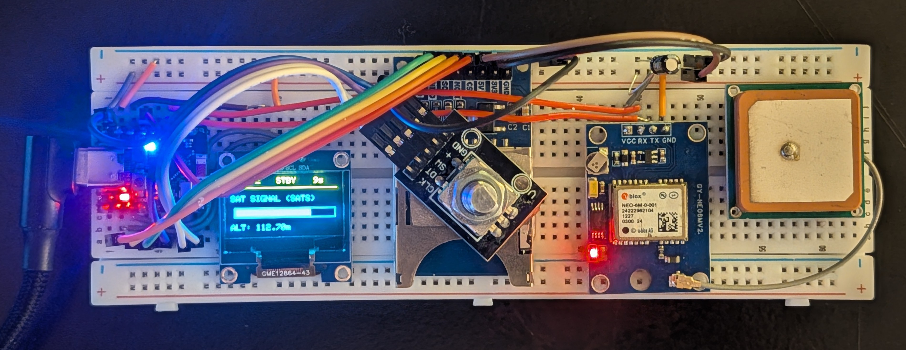

# Monolith Navigator: GPS Telemetry & Logging

A basic GPS data logger built on the ESP32-C3 Super Mini. This project features a multi-page OLED menu system, real-time satellite SNR monitoring, and FAT32 SD card logging.

## Partslist
* **MCU:** ESP32-C3 Super Mini
* **GPS:** NEO-6M Module + Active Ceramic Antenna
* **Display:** 0.96" Dual-Color OLED (SSD1306)
* **Storage:** MicroSD SPI Module
* **Control:** KY-040 Rotary Encoder

A critical challenge in this build was the **GPIO 10 (D10) Conflict**. On the XIAO ESP32-C3, D10 is internally tied to the Flash memory. Initializing SPI on this pin causes a boot-loop. Solved by utilizing ESP32-C3's internal GPIO matrix to remap the MOSI line to D3, moving the mechanical Encoder Switch to D10. This ensures the SPI bus remains silent during the boot-up phase.

* `/ESP32_GPS_DATABUILDER.ino`: Main firmware.

## Pinouts
| Component | Pin | Function |
| :--- | :--- | :--- |
| GPS | D1/D0 | Hardware Serial |
| OLED | D4/D5 | I2C |
| SD Card | D2/D8/D9/D3 | Remapped SPI |
| Encoder| D7/D6/D10 | Menu Control |

